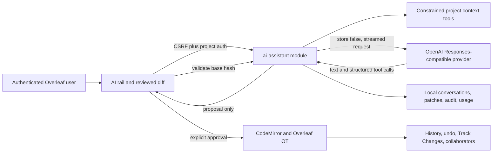

# Architecture

The source overlay adds `services/web/modules/ai-assistant/` and three narrow CE+ registration changes: module loading, a rail entry/editor bridge/compiler-log action, and the rail key type. The Docker build is pinned to one CE+ source revision so marker drift fails the build instead of silently producing a partial integration.

## Request flow

1. Overleaf repeats read authorization and the module checks the global switch, API key presence, user allowlist, and quotas.
2. The server stores the user's message locally and snapshots current project document metadata.
3. The model can call only `list_project_files`, `read_project_file`, `search_project`, `read_compile_diagnostics`, `request_compile`, and `propose_patch`.
4. `propose_patch` refetches every involved document and requires exact `oldText` at non-overlapping offsets before storing a proposal.
5. The client validates the proposal server-side, opens each selected document through Overleaf, verifies the base SHA-256 again, and dispatches accepted hunks through CodeMirror.
6. The client records the approving user, selected hunks, timestamp, and resulting hash. A multi-file failure stops subsequent application and preserves already-applied edits.

## Phase boundaries

- Phase 1: project chat, safe tools, reviewed patches, compiler assistance, local retention, quotas.
- Phase 2: verified scholarly search, bibliography import, multimodal equation/figure workflows.
- Phase 3: push-to-talk, review comments, project-owner controls, full-manuscript review modes.
